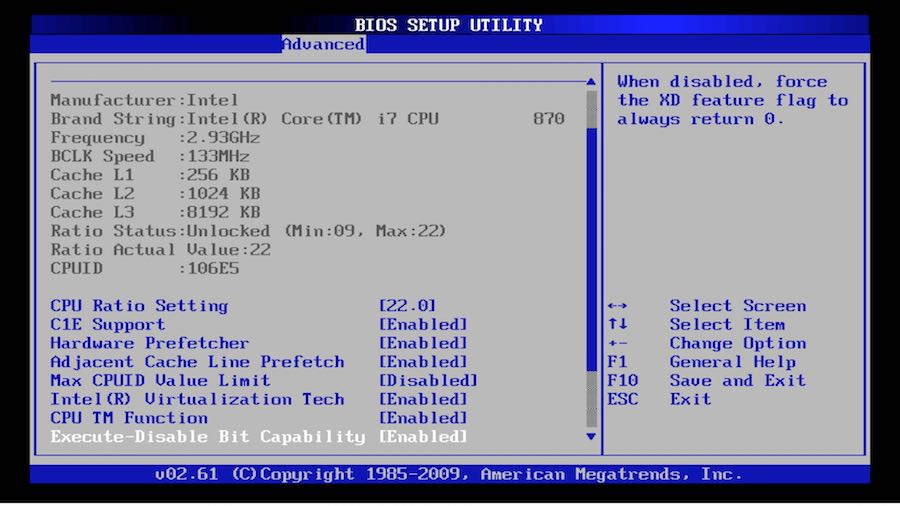

# System startup (Firmware Stage)
เป็นขั้นตอนแรกที่เกิดขึ้นเมื่อทำการเปิดเครื่อง มันจ่ายไฟฟ้าให้กับส่วนประกอบหลักทำงาน และจะทำการเรียกใช้ firmware โดย firmware ที่ใช้จะขึ้นอยู่กับ Hardware ของเครื่องนั้นๆ โดยหลักๆ จะมีการใช้ firmware อยู่ 2 ตัวหลักๆ  ดังนี้
## 1. BIOS (Basic Input/Output System)
### BIOS คืออะไร?
 Firmware ที่ไมโครโปรเซสเซอร์ของคอมพิวเตอร์ใช้ในการสตาร์ทระบบคอมพิวเตอร์หลังจากเปิดเครื่อง นอกจากนี้ยังจัดการการไหลของข้อมูลระหว่างระบบปฏิบัติการ (OS) ของคอมพิวเตอร์และอุปกรณ์ที่เชื่อมต่อ เช่น ฮาร์ดดิสก์ อะแดปเตอร์วิดีโอ แป้นพิมพ์ เมาส์ และเครื่องพิมพ์
### หลักการทำงาน
BIOS นั้นจะถูกติดตั้งมาพร้อมกับเครื่องคอมพิวเตอร์ โดยเป็น Firmware on chip ในเมนบอร์ด โดยเมื่อผู้ใช้เปิดเครื่อง
1. ฺBIOS จะทำการตรวจสอบไฟล์ต่างๆที่จำเป็นทั้งหมดว่ามีครบและใช้งานได้หรือไม่ โดยในทุกๆ Hardware ของเครื่องคอมพิวเตอร์ จะมีไฟล์ที่เรียกว่า "Boot devices" อยู่
2. หลังจากการตรวจสอบไฟล์ทั้งหมดและมั่นใจว่าทุกๆ "Boot devices" สามารถทำงานได้ปกติ BIOS จะทำการค้นหาตัว Master Boot Record (MRB) ซึ่งเป็นโปรแกรมขนาดเล็กที่ถูกจัดเก็บอยู่ในอุปกรณ์จัดเก็บข้อมูล(storage) นำมาดำเนินการ(executes)โปรแกรม ซึ่งจะทำการระบุถึงตำแหน่งของ "bootloader" และทำการโหลดเข้าสู่ memory และเริ่มทำการ run "bootloader"
3. นอกจาาการทำงานข้างต้น BIOS ยังทำหน้าที่ช่วยให้ผู้ใช้สามารถปรับเปลี่ยนการตั้งค่าฮาร์ดแวร์และระบบที่ถูกเก็บอยู่ใน CMOS ได้ด้วย
> CMOS(Complementary Metal-Oxide-Semiconductor) เป็นส่วนที่เก็บการตั้งค่าบางอย่าง เช่น วันที่ เวลา ลำดับการบูตซึ่งจะเป็นอุปกรณ์ที่ต้องใช้ไฟเลี้ยงอยู่ตลอดเพื่อให้ค่าการตั้งค่าคงอยู่ตลอดโดยจะใช้ CMOS Battery เป็นแหล่งจ่าไฟ

|  | 
|:--:| 
| *หน้าต่างการตั้งค่าของ BIOS * |

## 2. UEFI (Unified Extensible Firmware Interface)
```


# แหล่งอ้างอิง
- https://en.wikipedia.org/wiki/Booting_process_of_Linux
- https://www.techtarget.com/whatis/definition/BIOS-basic-input-output-system
- https://en.wikipedia.org/wiki/Bootloader
- https://www.baeldung.com/cs/bios-vs-cmos-vs-uefi
