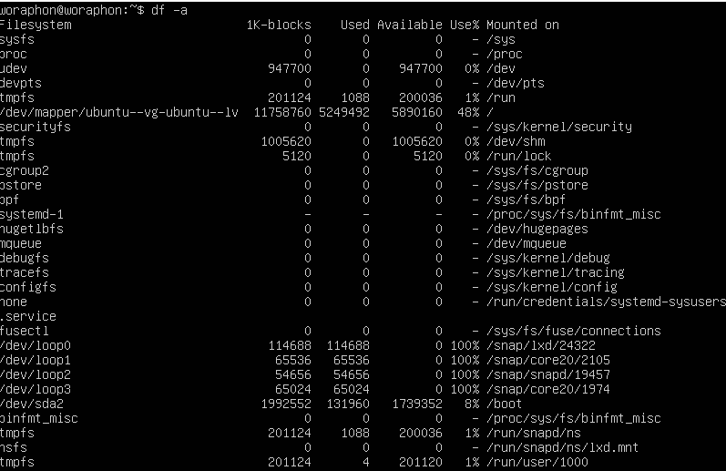
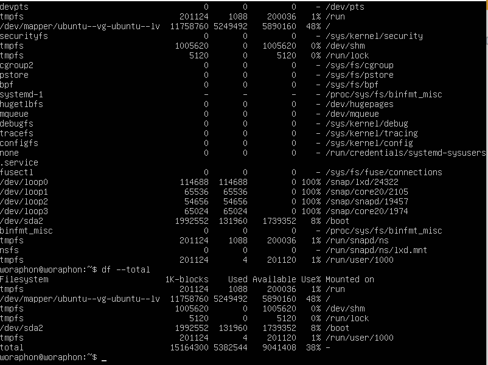
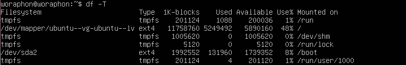

# คำสั่ง`df`
เป็นคำสั่งที่แสดงข้อมูลเกี่ยวกับ processes ที่กำลังทำงานอยู่ในระบบ
|อาร์กิวเมนต์|คำอธิบาย|ตัวอย่าง|
|---|-----------|-----|
|`-a` หรือ `--all`|แสดงข้อมูลไฟล์ในระบบทุกไฟล์|`df -a`|
|`-B` หรือ `--block-size=`|กำหนดขนาดของ block ที่ใช้ในการแสดงข้อมูล.|`df -B 1M`|
|`-h` หรือ `--human-readable`|แสดงข้อมูลในรูปแบบที่มนุษย์อ่านง่าย|`df -h`|
|`-H` หรือ `--si`|แสดงข้อมูลในรูปแบบที่มนุษย์อ่านง่าย|`df -H jayesh.txt`|
|`-i` หรือ `--inodes`|แสดงรายการข้อมูล inode แทนการใช้ block|`df -i`|
|`-l` หรือ `--local`|จำกัดรายการการแสดงข้อมูลไฟล์ local|`df -l`|
|`-P` หรือ `--portability`|แสดงข้อมูลในรูปแบบของ POSIX|`df -p`|
|`-sync`|sync ข้อมูลก่อนนำไปใช้|`df -sync`|
|`--total`|ลบรายการที่ไม่สำคัญออกและสร้างเป็นผลรวมขนาดไฟล์ทั้งหมด|`df --total`|
|`-t` หรือ `--type=`|จำกัดรายการประเภทไฟล์ในระบบ|`df -t`|
|`-T` หรือ `--print-type`|แสดงประเภทไฟล์ในระบบ|`df -T`|
|`-x`|แยกประเภทไฟล์ที่ระบุออกจากการแสดงผล|`df -x tmpfs`|
## ตัวอย่างการนำไปใช้
- แสดงข้อมูลเกี่ยวกับไฟล์ทั้งหมดในระบบ
> df -a

- แสดงข้อมูลเกี่ยวกับไฟล์ในระบบ โดยตัดบรรทัดที่ไม่มีความสำคัญออกไปและสรุปผลขนาดของไฟล์
> df --total

- แสดงข้อมูลเกี่ยวกับไฟล์ทั้งหมดในระบบ โดยระบุประเภทของไฟล์ด้วย
> df -T

- ถ้าหากไม่ต้องให้แสดงไฟล์ที่มีชื่อนี้ เราสามารถใช้คำสั่งต่อไปนี้ได้
> df -x tmpfs

***
# แหล่งอ้างอิง
- https://www.geeksforgeeks.org/df-command-linux-examples/
- https://saixiii.com/df-linux-command/
