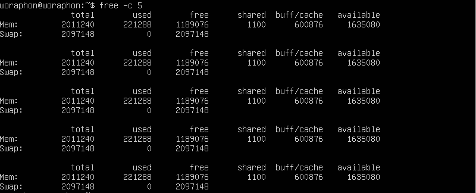

# คำสั่ง`free`
เป็นคำสั่งที่แสดงข้อมูลเกี่ยวกับการใช้งานหน่วยความจำในระบบ
|อาร์กิวเมนต์|คำอธิบาย|ตัวอย่าง|
|---|-----------|-----|
|`-b` หรือ `--bytes`|แสดงข้อมูลหน่วยความจำในหน่วย btytes|`free -b`|
|`-k` หรือ `--kilo`|แสดงข้อมูลหน่วยความจำในหน่วย kilobytes|`free -k`|
|`-m` หรือ `--mega`|แสดงข้อมูลหน่วยความจำในหน่วย megabytes|`free -m`|
|`-g` หรือ `--giga`|แสดงข้อมูลหน่วยความจำในหน่วย gigabytes|`free -g`|
|`--tera`|แสดงข้อมูลหน่วยความจำในหน่วย terabtytes|`free --tera`|
|`-h` หรือ `--human`|แสดงข้อมูลหน่วยความจำในรูปแบบที่อ่านง่าย|`free -h`|
|`-c` หรือ `--count`|จะแสดงข้อมูลหน่วยความจำเป็นจำนวนครั้ง|`free -c 3`|
|`-l` หรือ `--lohi`|แสดงข้อมูลหน่วยความจำทางสถิติต่ำและสูง|`free -l`|
|`-s` หรือ `--seconds`|แสดงข้อมูลหน่วยความจำแบบหน่วงเวลา|`free -s 5`|
|`-t` หรือ `--total`|แสดงข้อมูลหน่วยความจำโดยเพิ่ม total ไปในบรรทัดสุดท้าย|`free -t`|
## ตัวอย่างการนำไปใช้
- แสดงข้อมูลหน่วยความจำในหน่วย megabytes
> free -b

- แสดงข้อมูลหน่วยความจำในหน่วย megabytes
> free -m

- แสดงข้อมูลหน่วยความจำเป็นจำนวนครั้ง
> free -c 5 

- แสดงข้อมูลหน่วยความจำโดยมีสรุป total ไปในบรรทัดสุดท้าย
> free -t

***
# แหล่งอ้างอิง
- https://www.geeksforgeeks.org/free-command-linux-examples/
