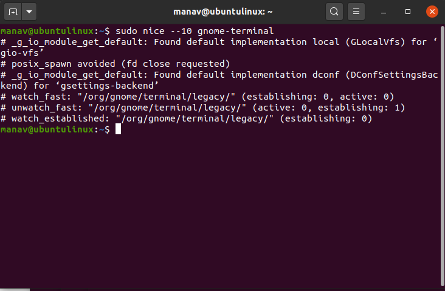

# คำสั่ง`renice`
เป็นคำสั่งที่ช่วยปรับเปลี่ยนในการจัดลำดับความสำคัญของ program/process ที่กำลังทำงานอยู่ มีค่าตั้งแต่ -20(ค่าความสำคัญสูงสุด) ถึง 19 (ค่าความสำคัญต่ำสุด) และ 0 คือค่าเริ่มต้น
|อาร์กิวเมนต์|คำอธิบาย|ตัวอย่าง|
|---|-----------|-----|
|`-n`|ตั้งค่าลำดับความสำคัญของ process|`renice -n 5 -p 987`|
|`-g`|ตั้งค่าลำดับความสำคัญของ process แบบกลุ่ม|`renice -n -4 -g 324 76`|
|`-p`|ตั้งค่าลำดับความสำคัญของ process แบบระบุโดย PID|`renice -n 5 -p 1234`|
|`-u`|ตั้งค่าลำดับความสำคัญ user|`renice -n 4 -u 8 sas`|
## ตัวอย่างการนำไปใช้
- แสดง process ที่ทำงานอยู่ในปัจจุบัน โดยมี format การแสดงคือ pid,ppid,nice value,comm
> ps -eo pid,ppid,ni,comm

> การเปลี่ยนค่า nice ของ process ที่มี PID คือ 671 โดยใช้คำสั่ง `sudo renice -n 5 -p 671`

- การเปลี่ยนค่า nice ของ user ในตัวอย่างนี้ชื่อ user คือ woraphon
> sudo renice -n -3 -u woraphon

***
# แหล่งอ้างอิง
- https://www.scaler.com/topics/linux-nice/
- https://www.ibm.com/docs/en/aix/7.1?topic=r-renice-command
